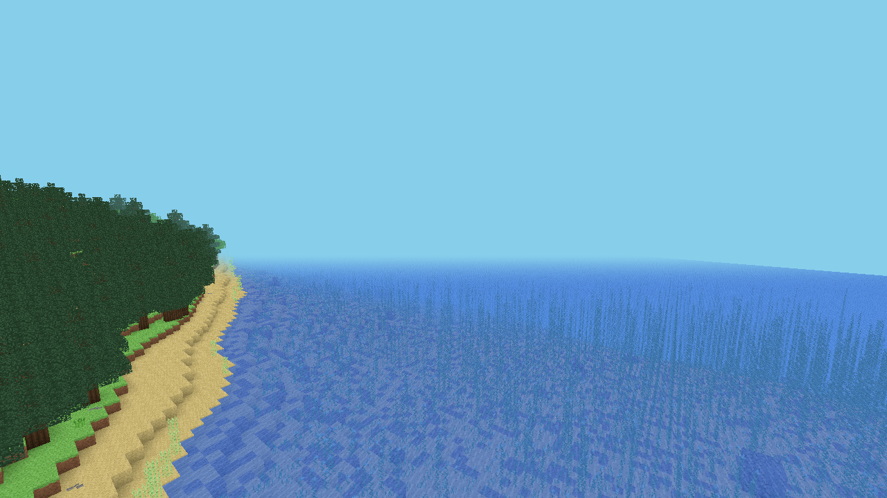
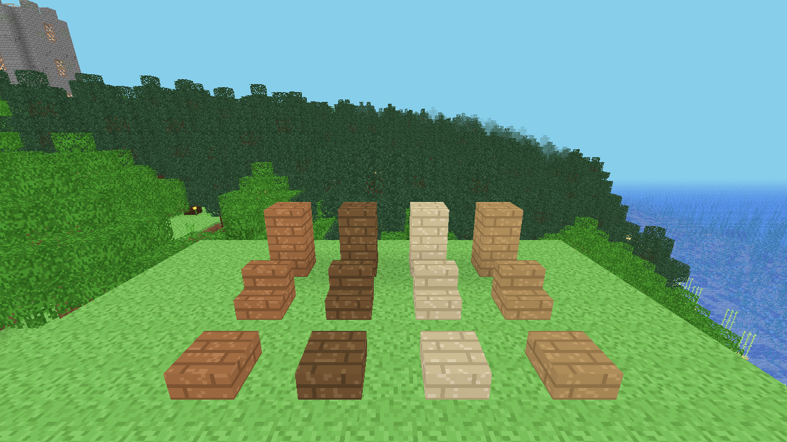

<div align="center">

# 🧱 Fable&nbsp;MC

**Ein Minecraft-Klon von Grund auf — im Browser, ohne Build-Schritt.**

Three.js · pure ES-Module · prozedurale Pixel-Texturen (kein einziges Bild-Asset) · läuft offline




</div>

---

## ✨ Was ist das?

Eine voll spielbare Voxel-Sandbox: unendliche, prozedural erzeugte Welt mit **21 Biomen**,
Höhlen, Dungeons, Türmen und Dörfern, Tag-/Nacht-Zyklus mit **sichtbarer Sonne, Mond & Wolken**,
Flüssen, Fluid-Simulation, Mobs & Zucht, Überlebensmodus mit Hunger und Rüstung, Crafting mit
Upgrade-System, XP & Level, Menü auf **Deutsch & Englisch**, frei belegbaren Tasten — und
Mehrspieler. **Alle Texturen werden im Code als Pixel-Art gemalt**, es gibt keinen Build-Schritt
und keine externen Dateien: einfach statisch ausliefern und im Browser öffnen.

---

## 🚀 Loslegen — drei Wege zu spielen

> Voraussetzung für die App und Mehrspieler: **[Node.js](https://nodejs.org)** installiert.
> Für „nur im Browser" reicht ein beliebiger statischer Server.

### 1 · 🌐 Im Browser (am schnellsten)

```bash
npm start
```

Dann im Browser öffnen: **http://localhost:8123**
_(Alternativ jeder statische Server im Projektordner, z. B. `python -m http.server 8123`.)_

### 2 · 🖥️ Als eigene Desktop-App _(empfohlen)_

Ein eigenes Fenster **ohne Browser-Drumherum** — dadurch stören keine Browser-Hotkeys mehr
(z. B. schließt **Strg+W** beim Sprinten nicht mehr das Fenster).

```bash
npm install     # einmalig (lädt Electron)
npm run app     # startet das Spiel im eigenen Fenster
```

Oder einfach **Doppelklick auf `Fable MC App.bat`**.

### 3 · 👥 Mehrspieler

**Doppelklick auf `Fable MC.bat`** → die **Steuerzentrale** öffnet sich in einem eigenen Fenster:
Welt auswählen oder neu anlegen (Name + Seed), Server **starten / stoppen / neustarten**,
PvP an/aus, Live-Infos (Spieler, Laufzeit, Log) und Moderator-/Bann-Verwaltung.

```bash
npm install     # einmalig
# danach: Doppelklick auf „Fable MC.bat"  (oder:  npm run launcher )
```

Mitspieler geben im Spiel ihren **Namen** ein und klicken **„Mehrspieler beitreten"** —
geteilte Welt, Truhen, Uhrzeit, Avatare, **Chat (Taste `T`)** und gemeinsame Monster, Tiere,
Drops & Events. Der erste Spieler ist „Host" und simuliert die Mobs; verlässt er das Spiel,
übernimmt automatisch der nächste.
👉 Vollständige Anleitung inkl. LAN / Port-Forwarding: **[MULTIPLAYER.md](MULTIPLAYER.md)**

| Willst du … | … dann |
| --- | --- |
| nur schnell reinschauen | **1 · Browser** (`npm start`) |
| in Ruhe alleine spielen | **2 · Desktop-App** (`npm run app`) |
| mit Freunden spielen | **3 · Mehrspieler** (`Fable MC.bat`) |

---

## 🎮 Steuerung

| Taste | Aktion | | Taste | Aktion |
| --- | --- | --- | --- | --- |
| **WASD** | Bewegen | | **E** | Inventar |
| **Leertaste** | Springen / Schwimmen | | **Q** | Item fallen lassen |
| **Strg** / 2×**W** | Sprinten | | **1–9** / Mausrad | Hotbar |
| **Shift** | Schleichen | | **T** | Chat (Mehrspieler) |
| **Linksklick** | Abbauen / Angreifen | | **F3** | Debug-Overlay |
| **Rechtsklick** | Platzieren / Essen / Werkbank | | **Esc** | Pause |

Kreativmodus: **2×Leertaste** fliegen · **B** Biom-Teleport · **F4** Spectator (Noclip)

> 💡 Alle Tasten sind in den **Einstellungen** frei belegbar — dort auch **Sprache (DE/EN)**,
> Sichtweite, **Wolken** an/aus, **Bildrate-Grenze & VSync**.

---

## 🌲 Highlights



- **Unendliche Welt** mit Chunk-Streaming in Web Workern, mehrschichtigem Noise-Terrain, **Flüssen** und **21 Biomen** (Ozean, Wald, Wüste, Savanne, Badlands, Dschungel, Gebirge, Pilzinsel, **Old Birch Forest**, **Spruce Valley** …)
- **Himmel & Wetter** — Tag-/Nacht-Zyklus mit **sichtbarer Sonne & Mond**, die je nach Uhrzeit über den Himmel wandern, dazu **Wolken** (an/aus) und Sterne; **Nebel, Wasser & Gras** werden je Biom eingefärbt
- **Beeren & neue Biome** — Beerenbüsche (rot/blau/gelb, essbar & anpflanzbar); **Old Birch Forest** (dicke Birken, umgestürzte Stämme, Pilze, Moos, dunkles Gras) und **Spruce Valley** mit garantiertem **Fluss** (dicke Fichten, laubbedecktes Gras, moosige Findlinge)
- **Liegende Stämme** — Stämme lassen sich in jede Richtung platzieren (X/Y/Z) → umgestürzte Bäume & Balken
- **Höhlensystem** — Kammern, Tunnel, Schluchten, Aquifere, Lavaseen; Tropfstein- & Lush-Höhlenbiome; volle **Licht-Engine** (Himmels- + Blocklicht wie in MC)
- **Fluid-Simulation** — Wasser & Lava mit Pegeln, Strömung, Verfestigung; animierte Strömungstextur & Gischt-Partikel
- **Struktur-Vielfalt** — Dörfer mit Villagern & **Handel**, Magier-Türme, prozedurale **Dungeons**, Dschungel-Tempel, Schiffswracks, Unterwasser-Ruinen, Wüstenbrunnen
- **Überleben** — Herzen, Hunger, Rüstung mit Verteidigung & Dornen, roh vs. gebraten, Fallschaden, Ertrinken; Tag-/Nacht-Zyklus mit Monstern
- **Mobs & Zucht** — Schweine, **Kühe** (Leder), Schafe (scherbar), Hühner, Fische, Zombies, Skelette, Creeper, Villager + Blutroter-Zombie-**Boss**; Tiere lassen sich füttern & **züchten**
- **Crafting & Upgrades** — 3×3-Werkbank, Werkzeuge/Rüstung in 5 Materialien, **Amboss**-Upgrades (kosten XP); **XP & Level**; **Bogen & Pfeile**
- **Verzauberungen** — Kühe → Leder → Bücher, Bücherregale, Obsidian & **Verzauberungstisch** (Spell Core aus Magier-Türmen); 3 Seltenheitsstufen würfeln **Unzerbrechlich, Effizienz, Schärfe, Schutz & Stauraum** (kosten XP + Smaragde/Saphire)
- **Bauen** — Truhen, Türen, Glas(scheiben), Leitern, Falltüren, Teppiche, Betten, **farbige Bretter, Treppen & Stufen** je Holzart (Eiche/Birke/Fichte/Dschungel)
- **Einstellungen** — Menü **Deutsch/Englisch**, **frei belegbare Steuerung**, Sichtweite, Wolken an/aus, **Bildrate-Grenze & VSync**
- **Speichern/Laden** — Autosave in `localStorage` (Einzelspieler) bzw. serverseitig (Mehrspieler)

_Die vollständige, sehr ausführliche Feature-Liste und die Architektur stehen in **[SPEC.md](SPEC.md)**._

---

## 🗂️ Projektstruktur

```
index.html              Einstieg (lädt js/main.js als ES-Modul)
js/                     Spiel-Code (pure ES-Module, kein Build)
  ├─ main.js            Boot + Game-Loop, verdrahtet alle Module
  ├─ worldgen.js        seedbare, deterministische Weltgenerierung
  ├─ world.js           Chunk-Streaming + Meshing (Face-Culling, AO)
  ├─ chunkmesher.js     Voxel-/Teilblock-Geometrie
  ├─ textures.js        16×16-Texturatlas, komplett im Code gemalt
  ├─ player.js physics.js entities.js survival.js inventory.js
  ├─ crafting.js experience.js daynight.js fluids.js flora.js
  ├─ clouds.js          Wolkenschicht am Himmel
  ├─ lang.js keybinds.js settings.js   Sprache (DE/EN), Tastenbelegung, Optionen
  └─ net.js             Mehrspieler-Client
config.js               Welt-Regeln (Tageslänge, Spawns, Schaden …)
lib/three.module.js     Three.js r185 (lokal → offline lauffähig)
server.js               Mehrspieler-Server (WebSocket, host-autoritativ)
launcher.js             Steuerzentrale (Welten/Server verwalten)
electron-main.cjs       Desktop-App-Fenster (Electron)
```

---

## 🛠️ Technik

Kein Build, kein Bundler, keine Framework-Abhängigkeit. Der einzige Laufzeit-Baustein ist
**[Three.js](https://threejs.org) r185** (liegt lokal in `lib/`, damit alles offline läuft).
Weltgenerierung und Fern-Terrain rechnen in **Web Workern**; Kollision ist tunnelsichere
AABB-Voxel-Physik; Sounds entstehen prozedural per **WebAudio** (kein Audio-Asset).
Der Mehrspieler-Server (`server.js`) braucht nur das `ws`-Paket und ist host-autoritativ.

---

<div align="center">
<sub>Gebaut mit Three.js · komplett prozedural · kein Build-Schritt</sub>
</div>
